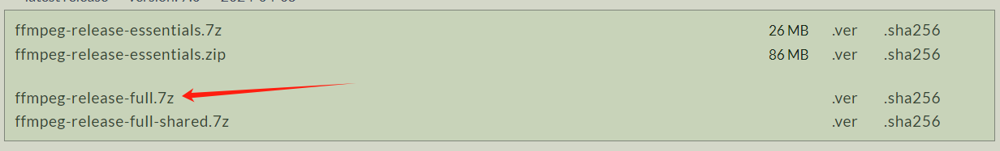

# 3D-Gaussian-Splatting

本项目用于记录3D-Gaussian-Splatting在Windows 11 的复现过程，可能出现的问题以及数据集的制作和训练

## 1. 克隆项目

克隆项目可以直接运行

```python
git clone https://github.com/graphdeco-inria/gaussian-splatting --recursive
```

值得注意的是，由于本项目涉及到了`子模块`。也就是说本项目克隆时还需要从其他仓库进行克隆，因此在`git clone`指令后面必须加`recursive`

###  可能出现的问题

#### 1. 利用Git Bash 进行克隆

有一些人可能直接会在本地文件夹下直接右键`Git here`后开启`Git`终端然后运行上面的语句


这样做可能会导致因为网络问题而无法克隆所有的仓库，因此你会在后面运行依赖安装指令的时候出现错误

##### 解决方法：

不要用该指令进行克隆，采用vscode的终端cmd直接克隆，或者采用我已经下好的[压缩包](https://pan.baidu.com/s/18KIUGOSvAudPlRCYXjGt6Q?pwd=0325)

## 2. 创建环境

### 2.1 创建conda环境

```
conda create -n 3D-Gaussian-Splatting python=3.10
```

### 2.2 外部环境

在安装依赖之前，必须要安装好外部的环境，该环境是非虚拟环境，是本地的相关软件

#### 2.2.1.CUDA 12.1  #该CUDA版本请从Nvidia官网下载

下载这个的原因是因为在代码中有设计到`CUDA_HOME`的环境变量，因此必须保证该环境变量被正确的添加到了`Path`中


#### 2.2.2.Visual Studio 2022 

需要下载下图所选的开发包。安装这个的原因是该项目是`Cu，C++以及Python`共同开发，因此需要保证你的本地可以运行C++


#### 2.2.3.Colmap 

`Colmap`的安装可以从下面的[官网](https://github.com/colmap/colmap/releases/tag/3.8)安装`COLMAP-3.8-windows-cuda.zip`，然后将其解压到本地的任意路径，只要之后能找到即可。也可以通过[压缩包](链接：https://pan.baidu.com/s/10K82B8Dhum5bSfWJ9zeJ-w?pwd=0325 )下载

随后将`Colmap`文件下的`COLMAP.bat`添加到系统变量中。运行下面代码，如果能正常启动，则说明添加成功

```
E:\COLMAP\COLMAP.bat
```

其中`E:\COLMAP\COLMAP.bat`是你自己所添加的环境路径

#### 2.2.4.ffmpeg

从[官网](https://www.gyan.dev/ffmpeg/builds/)下载，并解压到任意路径即可，也可通过[压缩包](https://pan.baidu.com/s/1ZZFcW0RdoGcE3qVm5lGpZQ?pwd=0325)下载



安装完后需要将`E:\ffmpeg\bin`添加到环境变量`Path`中，运行下面的代码确保你添加成功了

```
ffmpeg -version
```

#### 2.2.5.viewer

通过[压缩包](https://pan.baidu.com/s/1oL-eMnGckFIkxvxF2CSYxw?pwd=0325)下载，如果你直接使用我的压缩包的话，就不需要再安装这个了。并且我推荐把这个解压到`3D-Gaussian-Splatting`文件下面，方便后续使用


至此，外部所有依赖都安装完成了，请在继续后面操作的时候确保以上步骤都完成

## 3.安装依赖

运行下面代码安装依赖

```python
pip3 install torch torchvision torchaudio --index-url https://download.pytorch.org/whl/cu121
SET DISTUTILS_USE_SDK=1
pip install submodules\diff-gaussian-rasterization
pip install submodules\simple-knn
pip install plyfile
pip install tqdm
```

### 可能出现的问题

#### 1.子模块安装失败

假设你并没有采取我上面说的方法，或者你在 `git clone`的时候因为网络问题没有把所有子模块的仓库克隆全，则会出现下面的问题

```python
ERROR: Failed building wheel for diff_gaussian_rasterization
  Running setup.py clean for diff_gaussian_rasterization
Failed to build diff_gaussian_rasterization
ERROR: Could not build wheels for diff_gaussian_rasterization, which is required to install pyproject.toml-based projects
```

这是因为系统没有找到你目录下面的`diff_gaussian_rasterization`和`simple-knn`的`setup.py`文件，因此没法造`.whl`文件，所以安装不了

##### 解决方法：

直接利用我给你的安装包，里面的模块都是下载完全的

## 4.制作自己的数据集

### 4.1 生成图片

首先要在`3D-Gaussian-Splatting`的直接路径下创建`data/input`文件，然后转入`data`路径

```python
cd data
```

运行`ffmpeg`去将图片进行分割

```
ffmpeg -i input.mp4 -vf "setpts=0.2*PTS" input/input_%4d.jpg
```

其中你可以设置参数`setpts=0.2*PTS`,这个表示将原视频速度编程原来的5倍，具体原理是时间变成0.2倍，则播放速度就变成5倍，也可以用以下的命令指定每秒多少帧

```
ffmpeg -i input.mp4 -r 30 input/input_%4d.jpg
```

`-r 30` 指定了每秒输出30帧。你可以根据需要将30替换为其他任何数值来改变每秒的帧数。

最终的图片结果会被声称在`input`下。

<!--如果想获得更好的重建质量，则可以运行第二行代码，他能获得更多的分割图片。-->

### 4.2 生成点云

运行下列代码来调用`Colmap`生成点云和相机位姿

```
python convert.py -s data
```

若你从别的地方获取的项目代码，则需要修改`convert.py`中的第27行代码，将其改为

```
colmap_command = '"{}"'.format(args.colmap_executable) if len(args.colmap_executable) > 0 else "E:\COLMAP\COLMAP.bat"
```

源代码采用的是`colmap.exe`，但是在windows中由于缺少很多依赖，无法直接运行`colmap.exe`，因此我们选择一定打包好的`COLMAP.bat`，在配置外部依赖中也带领大家把`COLMAP.bat`添加成了环境变量，在任何命令行都可以直接使用。

### 4.3 训练数据

返回到`3D-Gaussian-Splatting`的直接路径下，运行下列代码即可开始训练

```
python train.py -s data -m data/output
```

### 4.4 可视化训练结果

```
cd viewer
.\bin\SIBR_gaussianViewer_app -m output
```

